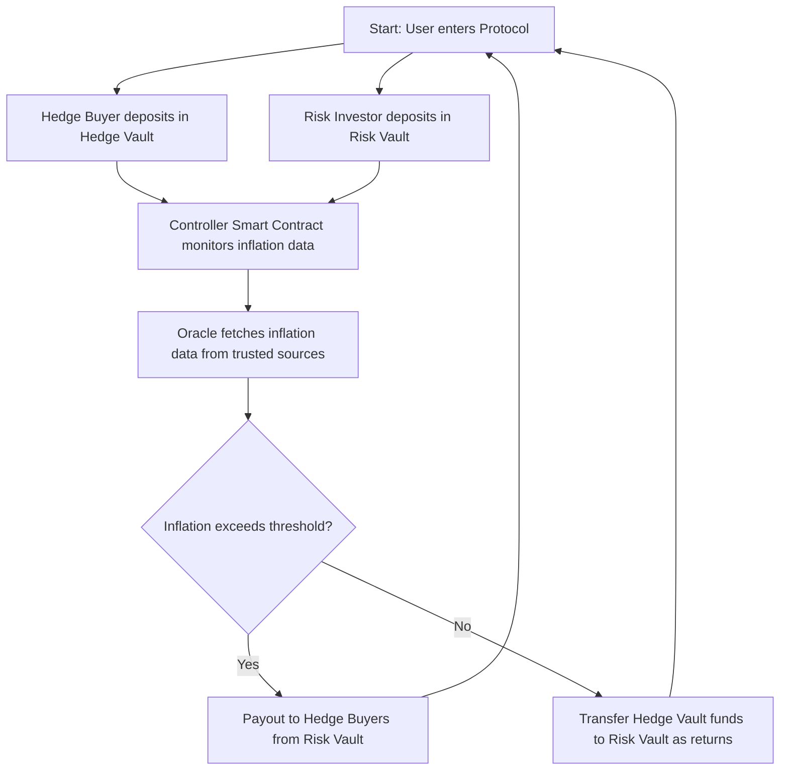

## Detailed Overview

### Introduction

This protocol is a decentralized hedge solution built on the Soroban blockchain, designed to provide trustless, automated inflation protection for users. By allowing individuals and businesses to hedge against the inflation risk of volatile currencies, such as the Nigerian Naira, the platform empowers those most impacted by inflation—especially people in non-developed countries where inflation risk is high, and financial products are often inaccessible. It connects people seeking protection with investors who assume that risk in exchange for potential returns, ensuring transparent, secure, and automated transactions via smart contracts and decentralized oracles. 

### Audience

- **Individuals or Businesses in High-Inflation Environments:** Especially those in non-developed countries, looking for ways to protect their earnings and savings from inflationary depreciation.
- **DeFi Investors:** Investors interested in underwriting inflation risk for a stable, real-world yield.

### How It Works

- **Hedge Buyers (Protection Seekers):** Users deposit funds into a Hedge Vault to protect against inflation risk.
- **Risk Investors:** Investors deposit into a Risk Vault to act as counterparties, providing liquidity for potential payouts if inflation surpasses the target level.
- **Controller Smart Contract:** Manages fund flow between Hedge and Risk Vaults, processing payouts based on verified inflation data from Acurast Oracle.
- **Oracle Integration:** The protocol uses Acurast’s Trusted Execution Environment (TEE) to source accurate inflation data from reputable financial institutions, ensuring data reliability and transparency.

If inflation exceeds the threshold, the Risk Vault pays out to those seeking protection. If not, Hedge Vault funds transfer to the Risk Vault, offering returns to investors.

### Protocol’s Vault System

Users deposit liquidity in **Hedge Vaults** (for inflation protection) or **Risk Vaults** (as counterparties) to manage capital based on their preferred risk positions. The protocol issues LP tokens to represent users' shares in these vaults, ensuring traceability of ownership.

Using an **Oracle** script on an **Acurast TEE Processor**, the protocol retrieves inflation data from trusted sources (such as central banks) and integrates it with Soroban smart contracts through [`js-stellar-sdk`](https://github.com/stellar/js-stellar-sdk).

The controller contract then assesses inflation data to determine if payout conditions are met. If inflation surpasses the threshold, funds move from the Risk Vault to the Hedge Vault for payouts; if not, funds in the Hedge Vault are transferred to the Risk Vault, providing returns to investors.
